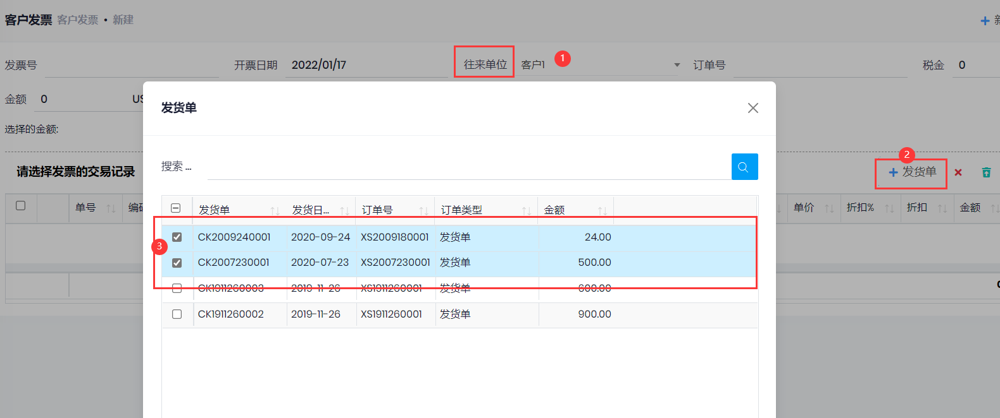
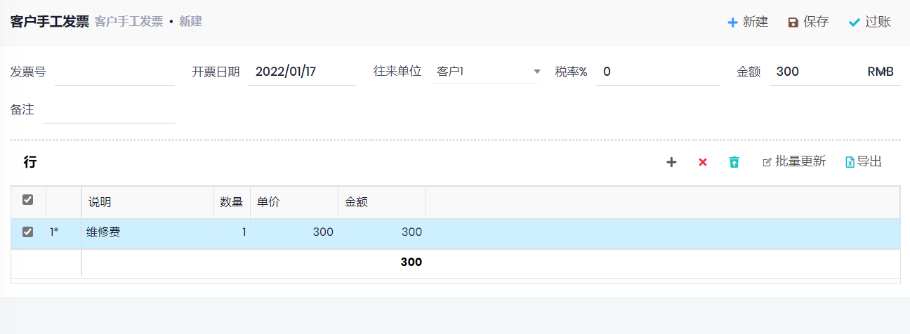

## 客户发票

### 销售发票
- 路径: 财务管理->应收账款->客户发票
- 点击新建, 输入`发票号`, 选择`往来单位`, 点击行工具栏的`收货单`按钮, 选择收货单, `保存`后`过账`.
- 也可以在`发货单`页面, 选择已过帐的收货单, 点击`开票`按钮.
- 过账后, 会更新`发货单行`的已开票数量, 并更新`发货单`的已开票状态.

### 手工发票
- 用于没有销售单的情况
- 在行中输入说明和单价
- 过账后, 产生客户交易记录.

