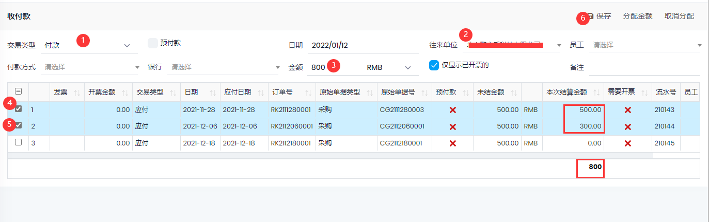
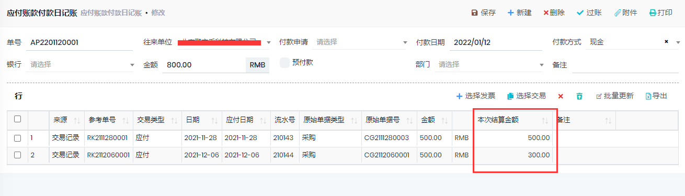

## 收付款

用于应收和应付的付款

1. 选择应收或应付
1. 选择往来单位, 自动列出要付款的交易记录
1. 输入本次付款的金额, 然后选择付款对应的交易记录, 每次选择的时候, 会自动添加结算金额直至余额为0
1. 或者不输入付款金额, 先选择交易记录, 会自动计算出要付款的合计金额
1. 保存后, 会生成付款日记账, 确认无误后, 过账

会创建如下的付款日记账, 过账后会增加付款记录并结算选择的交易记录

