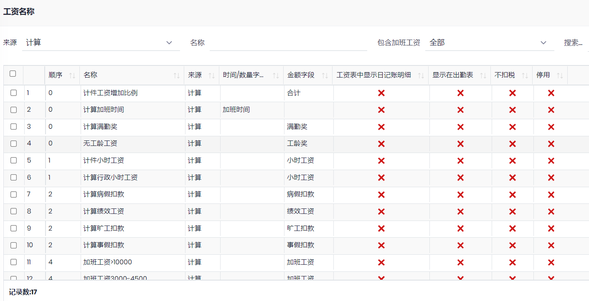
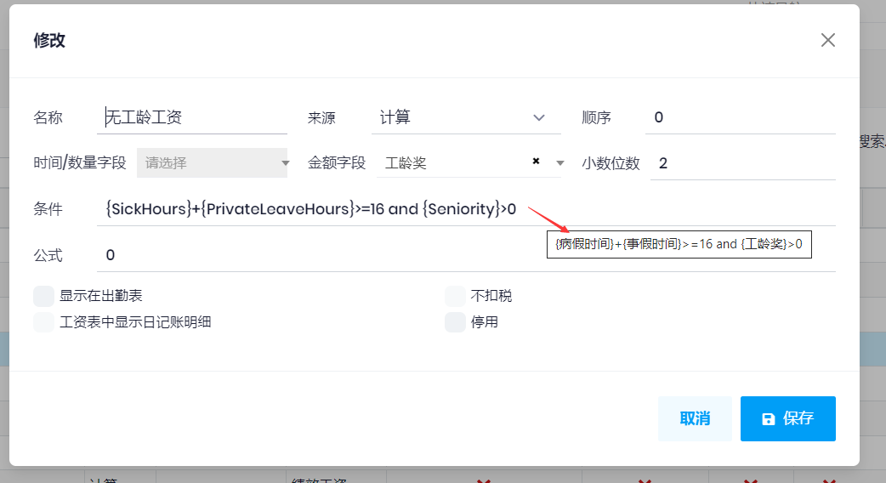

## 工资名称

用于设置工资的名称, 对应的工资表字段, 及工资的来源和计算方法等. 

设置工资名称之后, 可以进行工资设置

### 字段说明

- 来源: 
  - 日记账: 根据日记账的输入计算, 比如各种请假和补贴, 罚款等
  - 固定: 表示该项目是固定金额, 不受其他因素影响, 如出勤时间等
  - 设置: 表示该项目需要在**工资设置**中设置
  - 计算: 设置计算的项目: 小时工资, 缺勤工资, 病假工资等, 
      1. `时间/数量字段`和`金额字段`, 只能选择一个, 表示计算的结果放在那里. 
      2. `条件`表示当满足这个条件时, 才计算这个工资名称. 如需使用数据库字段时, 使用这样的格式, `{Skill}`表示技能工资. 数据库字段参见下面的工资表字段.
      2. `公式`是计算时使用的公式.  如需使用数据库字段时, 使用这样的格式, `{Skill}`表示技能工资. 数据库字段参见下面的工资表字段.
      
      例如:

  
- 顺序: 表示更新工资时, 按这个顺序来计算工资项目. 如: 先计算小时工资, 然后根据小时工资计算病假工资, 各种缺勤各种等.
- 不扣税: 表示该工资项目不需要扣税. 
- 工资表中显示日记账明细: 如果选中, 该工资名称会出现在工资表中.

### 工资表字段

<table><thead><tr><th>字段</th><th>说明</th></tr></thead>
<tbody>
<tr><td>EmployeeId</td><td>员工Id (员工页面可以看到)</td></tr>
<tr><td>OrganizationUnitId</td><td>部门Id</td></tr>

<tr><td>Year</td><td>年</td></tr>
<tr><td>Month</td><td>月</td></tr>
<tr><td>BasePay</td><td>基本工资</td></tr>
<tr><td>Position</td><td>岗位工资</td></tr>
<tr><td>PositionSubsidy</td><td>岗位补贴</td></tr>
<tr><td>Skill</td><td>技能工资</td></tr>
<tr><td>Seniority</td><td>工龄工资</td></tr>
<tr><td>Subsidy</td><td>补贴</td></tr>
<tr><td>PerformancePay</td><td>绩效工资</td></tr>
<tr><td>PerformanceQty</td><td>绩效分数</td></tr>

<tr><td>Total</td><td>应得工资</td></tr>
<tr><td>Paid</td><td>实发工资</td></tr>
<tr><td>Commission</td><td>提成</td></tr>
<tr><td>HourlyRate</td><td>小时工资</td></tr>

<tr><td>TaxableAmount</td><td>可扣税金额</td></tr>
<tr><td>NoTaxAmount</td><td>不扣税金额</td></tr>
<tr><td>TaxExemAmount</td><td>个税扣除项金额</td></tr>
<tr><td>FullTime</td><td>满勤奖</td></tr>
<tr><td>OverTime</td><td>加班工资</td></tr>
<tr><td>OverTimeHours</td><td>加班小时</td></tr>
<tr><td>WeekEndHours</td><td>周末加班小时</td></tr>
<tr><td>HolidayOvertimeHours</td><td>节假日加班小时</td></tr>
<tr><td>GeneralHoliday</td><td>假期工资</td></tr>
<tr><td>GeneralHolidayHours</td><td>假期小时</td></tr>
<tr><td>TimeOffInLieuHours</td><td>加班调休时间</td></tr>
<tr><td>PieceWork</td><td>计件工资</td></tr>
<tr><td>Bonus</td><td>奖励</td></tr>
<tr><td>Amercement</td><td>罚金</td></tr>
<tr><td>CalendarHours</td><td>应出勤时间(日历中设置的时间)</td></tr>
<tr><td>CalendarOvertimeHours</td><td>应加班时间(日历中设置的加班时间)</td></tr>
<tr><td>AttendanceHours</td><td>实际出勤时间</td></tr>
<tr><td>SickHours</td><td>病假时间</td></tr>
<tr><td>SickLeaveAmount</td><td>病假扣款</td></tr>
<tr><td>SickLeaveSubsidy</td><td>病假补贴</td></tr>
<tr><td>PrivateLeaveHours</td><td>事假时间</td></tr>
<tr><td>PrivateLeaveAmount</td><td>事假扣款</td></tr>
<tr><td>PaidLeaveHours</td><td>带薪休假时间</td></tr>
<tr><td>WeddingHours</td><td>婚假时间</td></tr>
<tr><td>LateHours</td><td>迟到小时</td></tr>
<tr><td>LateAmount</td><td>迟到扣款</td></tr>
<tr><td>EarlyLeaveHours</td><td>早退小时</td></tr>
<tr><td>EarlyLeaveAmount</td><td>早退扣款</td></tr>
<tr><td>AbsenceHours</td><td>旷工小时</td></tr>
<tr><td>AbsenceAmount</td><td>旷工扣款</td></tr>
<tr><td>OtherAbsenceHours</td><td>其他缺勤时间</td></tr>
<tr><td>OtherAbsenceAmount</td><td>其他缺勤扣款</td></tr>
<tr><td>InjuryHours</td><td>工伤时间</td></tr>
<tr><td>InjuryLeaveAmount</td><td>工伤金额</td></tr>
<tr><td>FuneralLeaveHours</td><td>丧假时间</td></tr>
<tr><td>FuneralLeaveAmount</td><td>丧假金额</td></tr>
<tr><td>Insurance</td><td>保险</td></tr>

<tr><td>OneChild</td><td>独生子女</td></tr>
<tr><td>Endowment</td><td>养老</td></tr>
<tr><td>Medical</td><td>医疗</td></tr>
<tr><td>Unemployment</td><td>失业</td></tr>
<tr><td>EmploymentInjury</td><td>工伤</td></tr>
<tr><td>Maternity</td><td>产假</td></tr>
<tr><td>HousingFund</td><td>公积金</td></tr>
<tr><td>EndowmentCompany</td><td>养老-公司</td></tr>
<tr><td>MedicalCompany</td><td>医疗-公司</td></tr>
<tr><td>UnemploymentCompany</td><td>失业-公司</td></tr>
<tr><td>EmploymentInjuryCompany</td><td>工伤-公司</td></tr>
<tr><td>MaternityCompany</td><td>产假-公司</td></tr>
<tr><td>HousingFundCompany</td><td>公积金-公司</td></tr>

<tr><td>Tax</td><td>个税</td></tr>
<tr><td>BankAccount</td><td>银行账户</td></tr>
</tbody>
</table>
