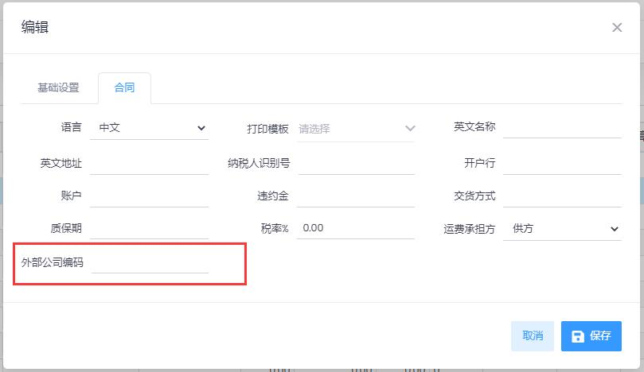
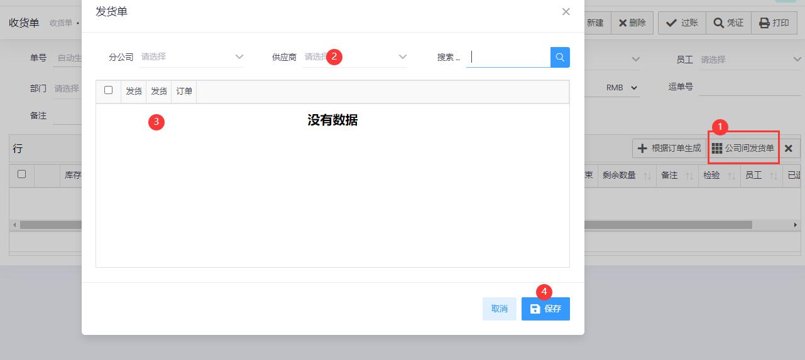

## 流程

```flowchart
st=>start: 开始
e=>end: 结束
setting=>parallel: 基础设置
op1=>operation: 物料:外部公司编号
op2=>operation: 供应商或客户:外部公司编码
op3=>operation: 采购订单
op4=>operation: 创建公司间订单
op5=>operation: 供应商确认产生的销售订单
op6=>operation: 供应商发货
op7=>operation: 收货单
st->setting->op5->e
setting(path1,right)->op1->op3
setting(path2, bottom)->op2->op3
op3->op4->op5->op6->op7->e
```

## 操作

1. 管理-->设置-->参数中, `启用公司间交易`
   
   

2. 在供应商和客户中设置`外部公司编码`, 即对方公司的网址前缀
   
   

3. 确保双方公司的`物料单位`相同, 如果`物料编号`不相同, 在物料中设置`外部物料编号`, 对应对方公司的编号
3. 如果物料启用了`物料属性`, 确保双方公司有同样的物料属性设置.

4. 新建采购单, 保存后, 点击公司间交易 -->创建公司间订单
   
   

5. 供应商在销售订单中点击`确认`

6. 供应商发货后, 新建收货单, 在收货单中选择 `供应商`, 和对应的发货单, 保存后自动生成收货单

