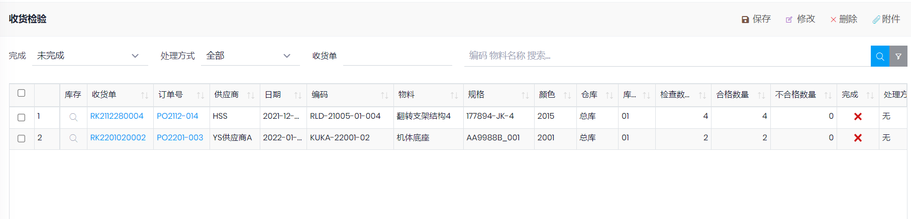

## 收货检验

- 过账`收货单`的时候自动生成
- 路径: 库存管理->收货检验
- 更新行内容时, 如果当前用户设置了关联`员工`, 则`质检员`自动填入当前用户对于的员工.
- 输入`合格数量`, `不合格数量`, 检验完成后, 勾选`完成`, 然后点击`保存`按钮. 如果对应的`收货单`中**所有的行**都已完成检验, 该收货单会自动入库, 状态变为已过帐.
- 勾选`完成`之后, 将不允许再次修改.
- 如果发现错误, 可以`取消过账``收货单`, 会删除对应的收货检验, 重新过账`收货单`后会再次产生`收货检验`.

