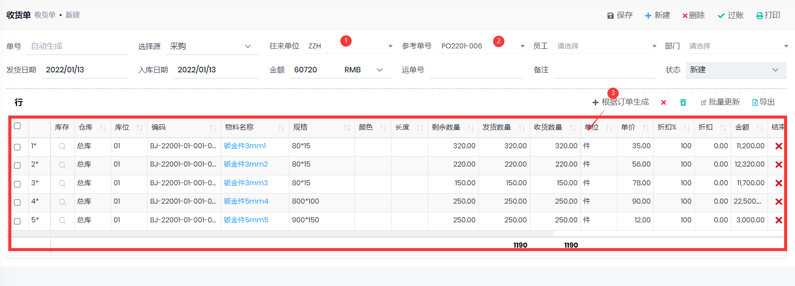

## 收货单

- 路径: 库存管理->收货单
- 方法1: 在`采购单`中点击`收货单`, 可以自动创建未收货行的收货单
- 方法2: 新建`收货单`, 选择`供应商`, 选择`参考订单`之后, 点击根据订单生成
- 收货单过账之后, 
    - 如果存在需要`收货检验`的物料, 收货单的状态变为`检验中`, 待质检完成之后, 会自动入库, 状态变为`已过帐`.
    - 如不需要检验, 则会入库, 状态变为`已过帐`.
    - 如果收货单行的物料对应了`外协作业`, 会自动生成改作业的`作业日记账`行.
    - 如果管理->设置->参数中, 没有启用`开票后产生交易记录`, 则会产生一条交易记录, 并增加供应商的应付款.
- 取消过账: 取消过账`收货单`, 会删除对应的收货检验, 重新过账`收货单`后会再次产生`收货检验`.

