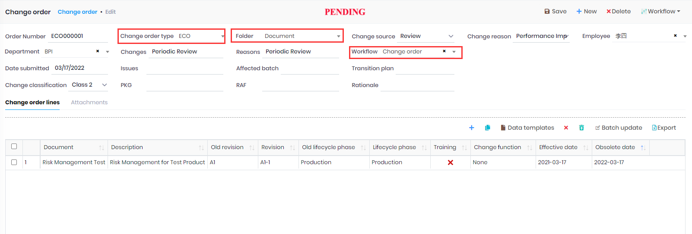
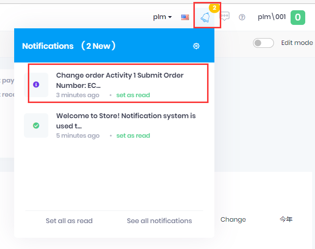

## Change order

1. Create a new Change order.
1. Fields:
    1. Change order type: The system generate the order number base on the setting of the selected [Change order type](ChangeOrderType.md).
    1. Folder: Please refer [Folder](Folder.md).
        1. Generate the Document Veriosn.
        2. Get the default workflow.
        3. The filter for the `Document` column in the line table.

1. Lines:
    1. Create lines and then choose the `Document`. The document list base on the selected Folder.
    2. Update the other colums if need.
1. Attachments:
    1. Choose a line, then click the `Attachments` tab.
    2. Click the +button on the header, choose a file upload.

1. Save the order and click `Workflow` button -> Submit. The status of the Change order changed to Pending.
2. The user selected in the workflow who need review the change order, will get the notification to approve it.

The notification:

1. Click the notification, the system will redirect to the `Change order` page.
1. Click `Workflow` button, to Approve or Reject.
1. Email notification:
    1. Go to Administration->Settings->Email(SMTP), setup the email sender information.
    2. Edit the user and check `Enable email notification`.

