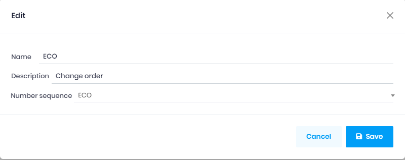

## Change order type

The `change order type` used for the `change order`, to genarate the order number base on the `Number sequence` field.
You can create more `Chang order type` if you need different order number format, and then choose it on the [Change order](ChangeOrder.md) page.

