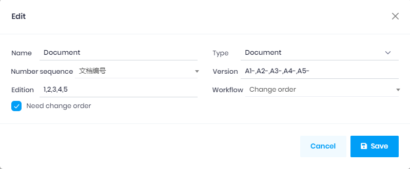

## Document type

The `Document type` is the common settings of the `Folders` which belong to this document type.

Fields:
1. Type: Document.
1. Number Sequence: The default number sequence (document No.) of the document, the `Number sequence` on the [Folder](Folder.md) will override this.
1. Version: For example A1-,A2-,A3-
1. Edition: 
    1. For example 1,2,3,4... 
    2. This combine with the Version, the first version of the document will be A1-1, the `Edition` will change to the next for each change order, A1-2,A1-3,A1-4... 
    3. Once the Edition reached the last number, the Version will change to the next(A2-), and the document version will be A2-1.
1. Workflow: The default workflow of the change order, the `Workflow` on the [Folder](Folder.md) will override this.
1. Need change order. This should be checked if the document need `Change order`.