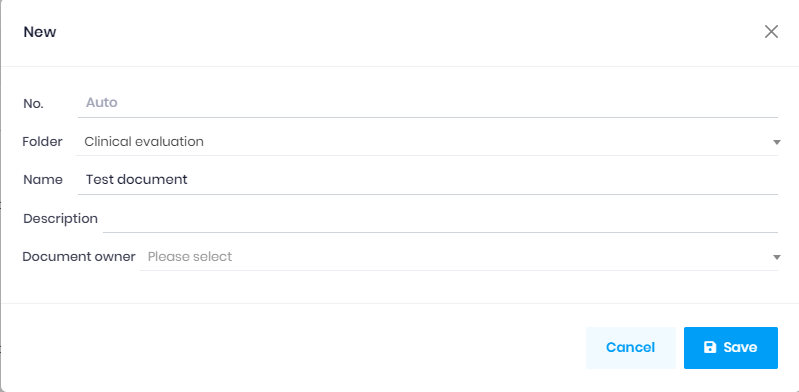
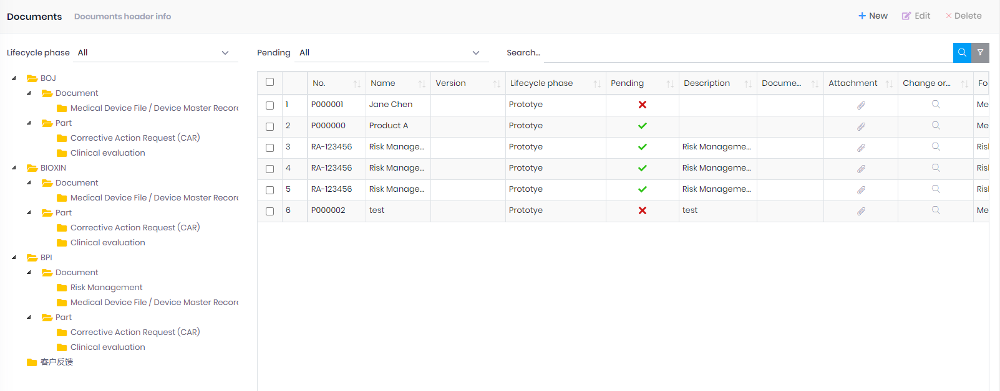

## Document

1. Click the 'New` button to create a document.
   
   | Field           | Description                                                                                                                                                 |
   | --------------- | ----------------------------------------------------------------------------------------------------------------------------------------------------------- |
   | No.             | Can enter it manually. If it's blank, the system will genarate a number base on the setting on the [Folder](Folder.md) or [Document type](DocumentType.md). |
   | Folder          | It's mandatory.                                                                                                                                             |
   | Name            | The document name.                                                                                                                                          |
   | Document owner. |                                                                                                                                                             |

2. The lifecycle phase is <mark>Prototype </mark>when the new document saved.

The fields in the list:

| Field           | Description                                                                                                                                            |
| --------------- | ------------------------------------------------------------------------------------------------------------------------------------------------------ |
| Version         | Automatically assigned once the [Change order](ChangeOrder.md) workflow complete. From the settings on the [Document Type](DocumentType.md).           |
| Lifecycle phase | It's <mark>Prototype</mark> for a new document, will be changed once the `Change order` workflow complete.                                             |
| Pending         | It's true if the document in a pending [Change order](ChangeOrder.md), will change to false once the [Change order](ChangeOrder.md) workflow complete. |
| Attachment      | View or download the approved attachment.                                                                                                              |
| Change order    | View the change order history.                                                                                                                         |

