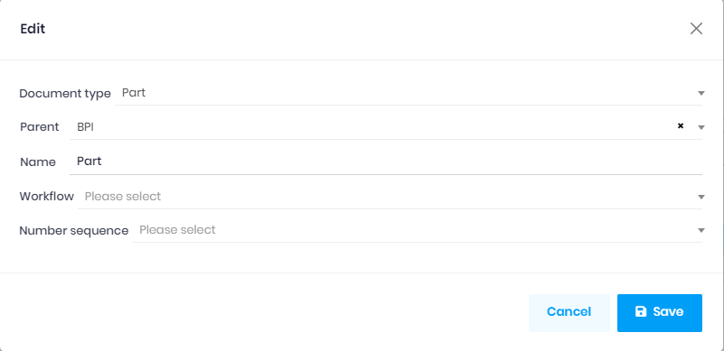
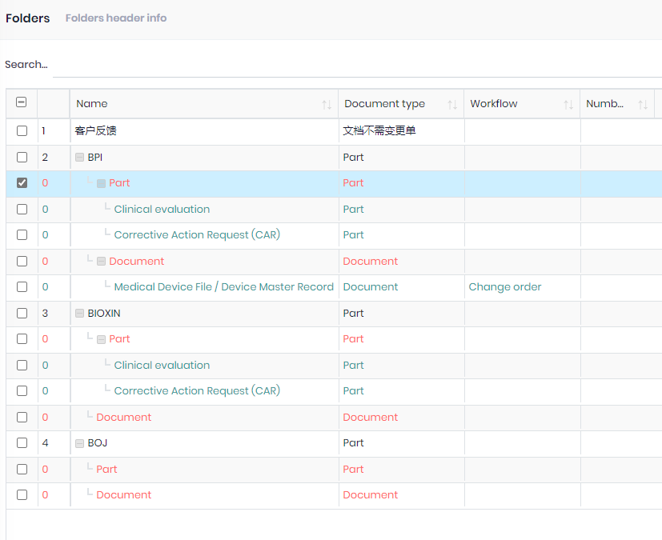

## Change order type

The `change order type` used for the `change order`, to genarate the order number base on the `Number sequence` filed.
You can create more `Chang order type` if you need different order number format, and then choose it on the `Change order` page.

## Folder

Fields:
1. Document type: Ther `version` of the documents which belong to this folder, will use the Version settings of the [Document type](DocumentType.md).
1. Parent: The parent folder.
1. Workflow: 
    1. The workflow of the change order, this will override the `Workflow` on the [Document type](DocumentType.md).
    2. Leave it empty if you want to use the settings on the folder.
1. Number Sequence: 
    1. The number sequence (document No.) of the document, this will override the `Number sequence` on the `Folder`.
    2. Leave it empty if you want to use the settings on the folder.

### Permissions

1. Choose one or more folders in the list, and then click the `Permissions` button.
1. The user can't see the folder in the `Documents` page if no permissions.

