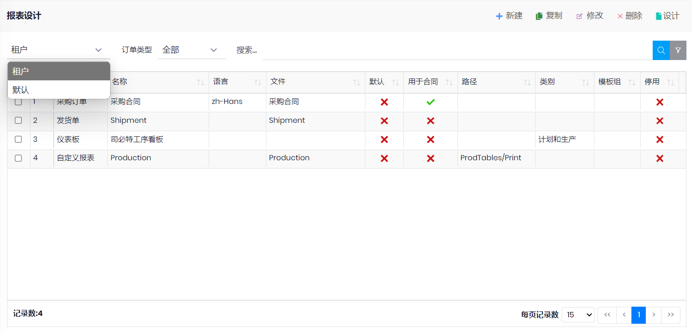

## 路径: 
- 管理-->报表设计

## 说明
- 报表分为系统默认报表和租户自建报表, 可以筛选 租户和默认
- 系统默认报表不允许用户修改
- 如要自定义系统已有的报表样式, 可以先筛选默认报表, 选择要修改的报表, 点击***复制***, ***保存***成租户自己的报表, 然后点击***设计***按钮进行修改并***保存***

## 字段
- 订单类型: 选择报表用于的订单或者自定义报表, 仪表板, 图表等
- 名称: 报表的名称, 设置后, 在工作台的*自定义报表* 中会自动按系统已有的本地化文本显示
- 标题: 图表的标题
- 语言: 该报表对应的语言, 用于根据客户的语言设置不同的报表
- 文件: 该报表保存成的文件名, 如果不设置文件夹, 报表会保存在数据库中
- 路径: 用于自定义报表针对的url地址
- 类别: 自定义报表时, 显示在工作台*自定义报表*中的类别
- 许可: 该报表需要的权限
- 模板组: 将报表分为不同的组, 可以在管理-设置中设置默认的模板组, 比如有三等分的模板和A4的模板