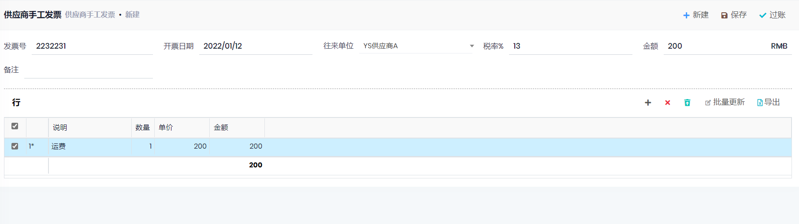

## 供应商发票

### 采购发票

- 路径: 财务管理->应付账款->供应商发票
- 点击新建, 输入`发票号`, 选择`往来单位`, 点击行工具栏的`收货单`按钮, 选择收货单, `保存`后`过账`.
- 也可以在`收货单`页面, 选择已过帐的收货单, 点击`开票`按钮.
- 过账后, 会更新收货单行的已开票数量, 并更新收货单的已开票状态.

### 手工发票

- 用于没有采购单的情况
- 在行中输入说明和单价

