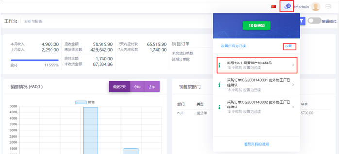
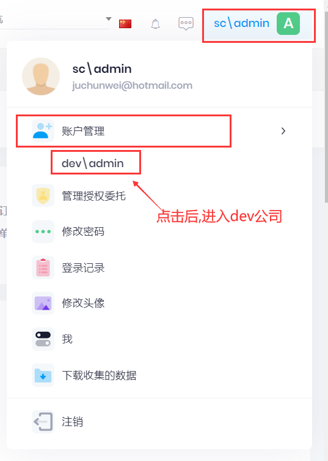
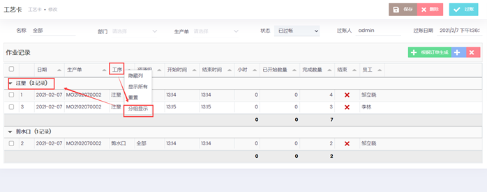

## 聊天

## 通知

- 页面右上角显示通知信息(见下图), 显示最近的3条通知信息

- 点击`设置`, 可以订阅通知, (见通知设置图), 选择需要订阅的通知. 

- 点击某一个通知, 可以打开通知对应的页面

- 点击`查看所有通知`, 可以打开所有的通知页面

## 关联用户

- 将其他公司的用户和当前用户关联, 设置后, 点击关联用户可之间进入关联公司
- 管理委托授权: 将自己的权限,指派给其他用户, 可以设置委托期间

## 表格操作

1. 右键点击列头，可以显示菜单

2. 可以拖拽列，调整显示顺序

3. 分组显示

## 期初设置

- 公司名称和地址信息: 管理-->公司和门店信息, 新建, 部门留空. 输入其他信息

- 公司Logo. 管理-->设置, 上传Logo, Logo会显示在打印的报表和合同中

## 数据导入

- 数据模板, 点击[下载]([https://www.erp.keyapp.com.cn/template.zip](Https://www.erp.keyapp.com.cn/template.zip))模板

- 商品数据导入

- 期初库存导入

- 客户和供应商资料导入

- 员工导入

### 物料清单导入

### 用户导入
