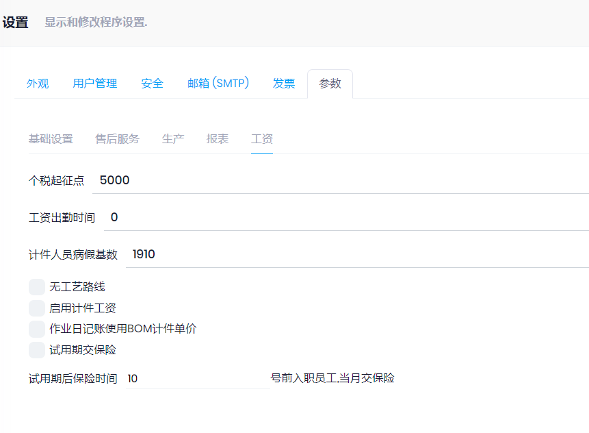

工资模块用于计算员工的工资, 包括个税, 保险, 计件工资等.  并导出银行需要的文件格式

## 基础设置

1. 参数
2. 组织机构
3. [银行](../Financial/bank.md)
4. 工资[日历](../../Production/Calendars.md), (或者设置标准的每月计算公司的时间, 但新员工需要用日历)
5. [员工](../Employees.md)
6. [保险](Insurances.md)
7. [个税减免项](TaxExemptions.md)
8. [工资名称](PayrollItem.md)
9. [工资设置](PayrollSetup.md)
10. 银行文件格式设置
11. 计件工资:
    1. [工序](../../Production/Operations.md)
    2. [计件单价](PieceworkPrice.md)

## 步骤

1. 参数设置: 管理-->设置
   
   

2. 确认**基础设置**完成

3. 录入当月的考勤和其他的工资奖罚情况(工资日记账), 工资日记账须过账后才生效

4. 录入员工产量([作业汇报](../../Production/JobReport.md)), 须过账后生效

5. 在**工资表**中, 选择月份和部门, 点击更新

6. 在**工资表**中, 导出银行文件