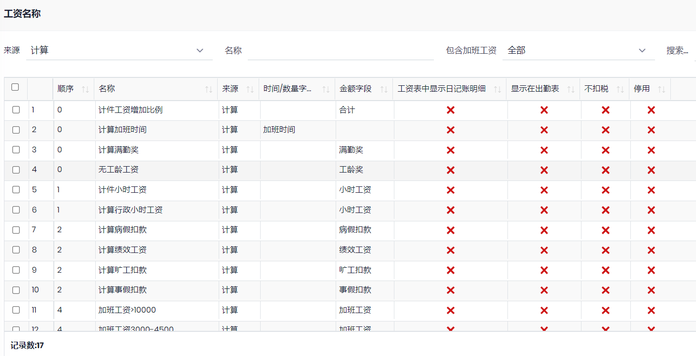
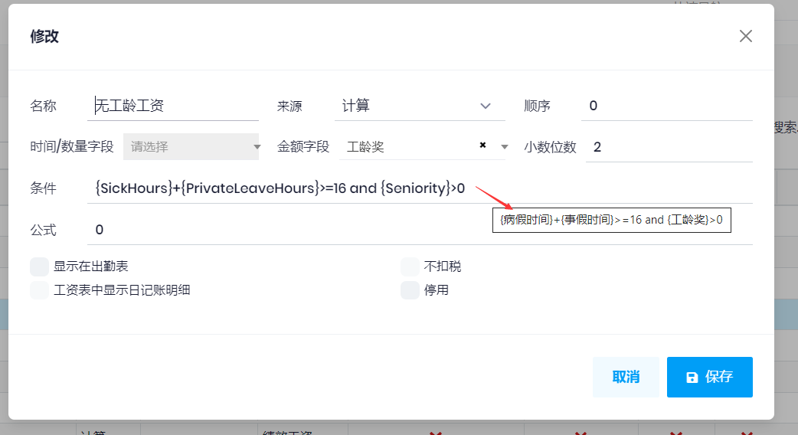

## 工资名称

用于设置工资的名称, 对应的工资表字段, 及工资的来源和计算方法等. 

设置工资名称之后, 可以进行工资设置

### 字段说明

- 来源: 
  - 日记账: 根据日记账的输入计算, 比如各种请假和补贴, 罚款等
  - 固定: 表示该项目是固定金额, 不受其他因素影响, 如出勤时间等
  - 设置: 表示该项目需要在**工资设置**中设置
  - 计算: 设置计算的项目: 小时工资, 缺勤工资, 病假工资等, 例如:

  
- 
