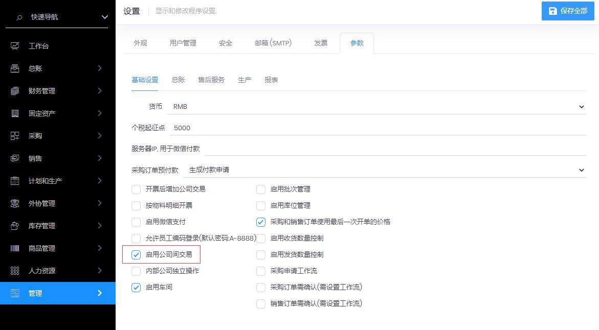
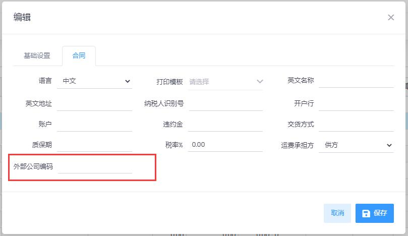
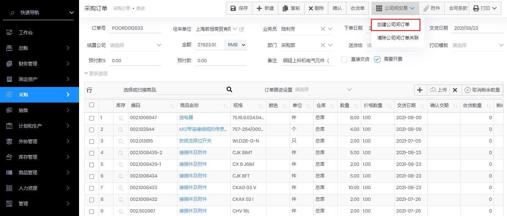
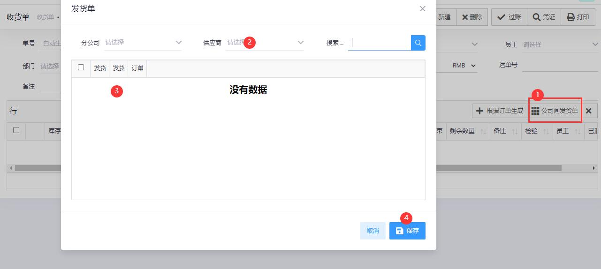

## 流程

```flowchart
st=>start: 开始
e=>end: 结束
setting=>parallel: 基础设置
op1=>operation: 物料:外部公司编号
op2=>operation: 供应商或客户:外部公司编码
op3=>operation: 采购订单
op4=>operation: 创建公司间订单
op5=>operation: 供应商确认产生的销售订单
op6=>operation: 供应商发货
op7=>operation: 收货单
st->setting->op5->e
setting(path1,right)->op1->op3
setting(path2, bottom)->op2->op3
op3->op4->op5->op6->op7->e
```

## 操作

1. 管理-->设置-->参数中, ***启用公司间交易***
   
   

2. 在供应商和客户中设置***外部公司编码***, 即对方公司的网址前缀
   
   

3. 确保双方公司的<u>**物料编号和物料单位**</u>相同, 或者在物料中设置**<u>外部物料编号</u>**, 对应对方公司的编号

4. 新建采购单, 保存后, 点击公司间交易 -->创建公司间订单
   
   

5. 供应商在销售订单中点击确认

6. 供应商发货后, 新建收货单, 在收货单中选择 供应商, 和对应的发货单, 保存后自动生成收货单

