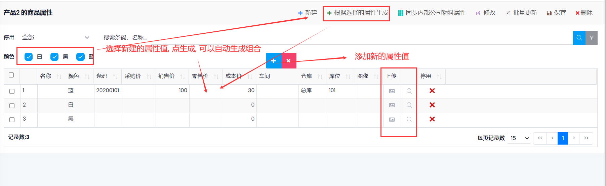

# 物料管理

- 设置和维护物料、服务等

## 启用物料属性

- 设置系统允许使用的物料属性,最多可以设置10个

- 物料管理-->物料属性 管理中设置属性的显示顺序和名称(比如颜色,尺码等), 如果设为负数, 表示该属性不使用该属性

## 物料设置

1. 路径：物料管理-->物料

2. 首先添加*类别*

3. 添加物料时, 需要设置类别, 名称, 单位, 其他资料根据需要设置, 拼音码在保存物料时自动生成, 用于录入单据时搜索用

## 物料字段说明:

- 计划类型: 
  
  - 生产：表示该物料需要生产, 可以创建生产单, (使用生产管理时需要设置). 运行主计划时生成的计划订单类型为生产单
  
  - 采购: 表示该物料需要采购, 运行主计划时生成的订单类型为采购单
  - 外协采购: 用于生产工序外协, 不需要提供原材料, 生成采购单
  - 外协: 用于生产工序外协, 需要提供原材料, 生成外协生产单

- 供应商: 设置物料的默认供应商, 确认计划订单时可以自动创建采购单

- 默认仓库和库位: 开单时的默认仓库和库位

- 库存物料: 物料设置为“库存物料”时会更改库存数量

- 收货时需要检验: 设置“收货时需要检验”，在过账收货单时会生成“收货检验”行，（库存管理->收货检验）

- 批次管理：需要在系统设置中“启用批次管理”，然后在物料设置中设置物料的批次产生的时间，有效期，批次号的格式。

- 图片: 在订单行中点库存查询时显示, 生产单打印时

- 外部物料编码: 用于公司间交易时, 读取对方公司的物料设置

## 物料属性
- 物料创建后, 如需修改物料的属性, 在物料页面, 选择物料, 然后点击工具栏上的**物料属性** 按钮
- 如果物料已经使用, 不允许增加新的属性, 但可以增加属性值
- 可针对物料属性, 设置价格和图片,默认仓库,库位等

