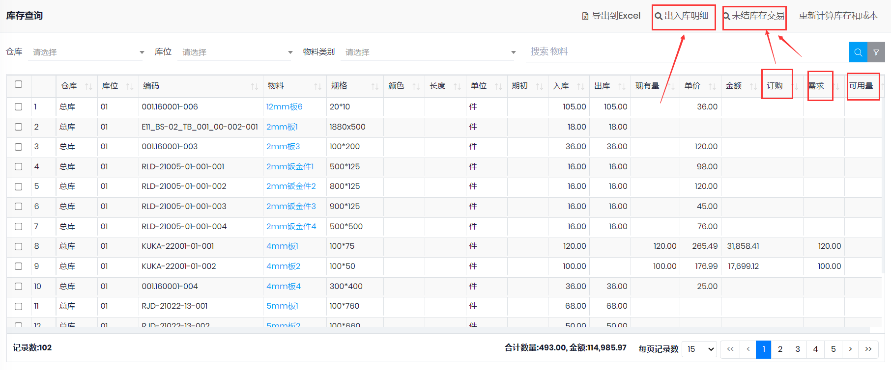

## 库存查询

- 路径: 库存管理->库存查询
- 订购: 表示将要入库的数量, 包括未入库的采购单, 其他入库单, 盘点中的盘盈, 调拨单的转入, 生产未入库等
- 需求: 表示将要出库的数量, 包括未出库的销售单, 其他出库单, 盘点中的盘亏, 调拨单的转出, 生产BOM等
- 可用量: =现有量+订购-需求
- 选择一行, 点击`出入库明细`, 可以查看出入库的交易记录(已过帐的). 点`击未结库存交易`, 可以查看`订购`和`需求`的来源
-

