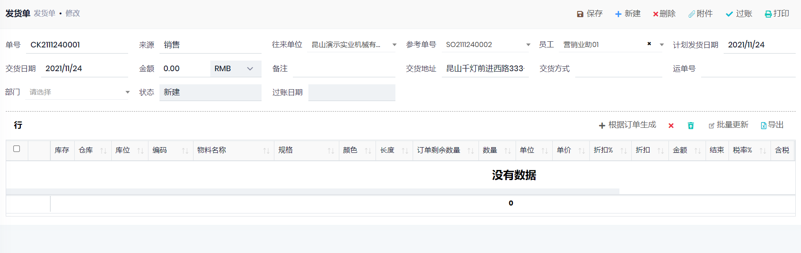

## 发货单

- 路径: 库存管理->发货单
- 方法1: 在`销售单`中点击`发货单`, 可以自动创建未发货行的发货单
- 方法2: 新建`发货单`, 选择`客户`, 选择`参考订单`之后, 点击根据订单生成
- 如果为发货计划, 可以填写计划发货日期, 填写需要发货的物料, 保存后不过账, 待时间发货之后过账.
- 过账后
    - 减少库存现有量
    - 如果管理->设置->参数中, 没有启用`开票后产生交易记录`, 则会产生一条交易记录, 并增加客户的应收款.

