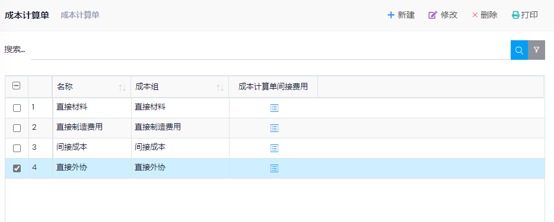
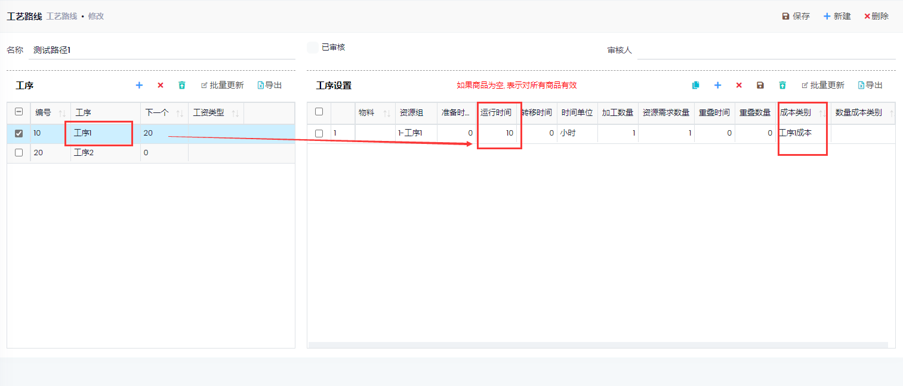
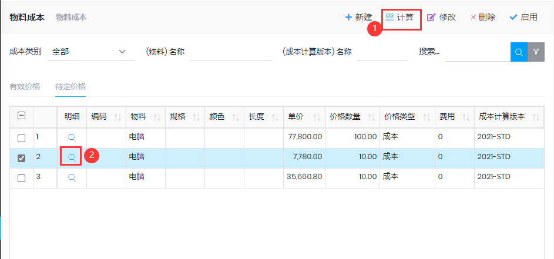
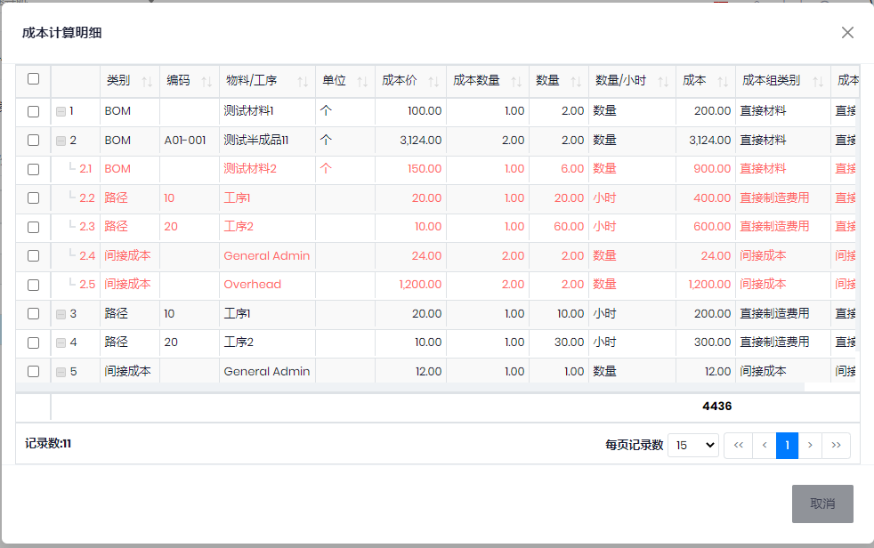
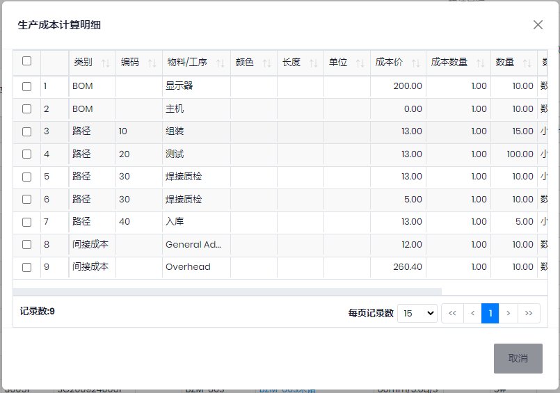

## 基础设置
- 成本组: 库存管理->成本->成本组
- 成本计算单: 设置产品成本的组成. 
    - 间接费用, 如果`费用类型`是`固定`, 则按产品`数量`计算. 如果是`百分比`, 则按成本额的百分比计算
    
- 

- 成本类别: 计划和生产->设置->成本类别
- 路径中设置"设置成本",`成本类别`(按时间计算)和`数量成本类别`(按产量计算)

- 成本计算版本: 库存管理->成本->成本计算版本

## 成本计算
- 库存管理->成本->物料成本
- 在`待定价格`页, 点击计算, 填写相关信息, 会根据BOM和工艺路线计算产品的成本. 点击明细可以看成本明细

- 计算时, 如果是半成品或者计划物料, 则会分解计算成本, 如果是需要采购的原材料或者外协, 使用采购价或者`采购和销售订单使用最后一次开单的价格`(管理->设置->参数). 
- 选择计算好的待定价格, 点击`启用`, 会转到有效价格中,并且会更新**成品或半成品**`物料`(或者对应的`物料属性`)中的成本, 在生产单的成本计算中, 对于半成品会使用该成本计算估计成本.

## 生产单成本

- 路径中设置"设置成本",`成本类别`(按时间计算)和`数量成本类别`(按产量计算)
- 成本计算, 选择生产单, 点击`操作`->`成本计算`:
    - 计算生产作业的估计成本, 并带入半成品当时的库存"成本单价"或者半成品物料信息中的成本(参见上面的成本计算), 采购的物料使用采购价, 如果启用了`采购和销售订单使用最后一次开单的价格`, 则会使用最后一次购买的价格. 
    - 点击`浏览`->`生产成本计算明细`可以查看成本组成
- 如果没有点击`成本计算`, 在生产单`下达`或`开始`的时候, 会自动进行计算

- 过账作业日记账时, 根据工艺路线中工序的成本类别, 计算成本, 记录`生产路径交易`.
- 生产点击`结束`,
    - 计算生产单的`间接成本`和实际成本, 点击`浏览`->`生产领料明细`, 可以查看物料成本. `生产路径交易`, 可以查看人工成本. 
    - 更新入库单的成本和库存成本. 如果在生产单`结束`之前, 入库的产品有出库情况, 那么需要运行`重新计算库存和成本`, 系统会重新计算出库交易的成本.
- 生产成本分析: 计划和生产->报表->`生产成本分析`, 可以查看估计成本和实际成本的差异.
