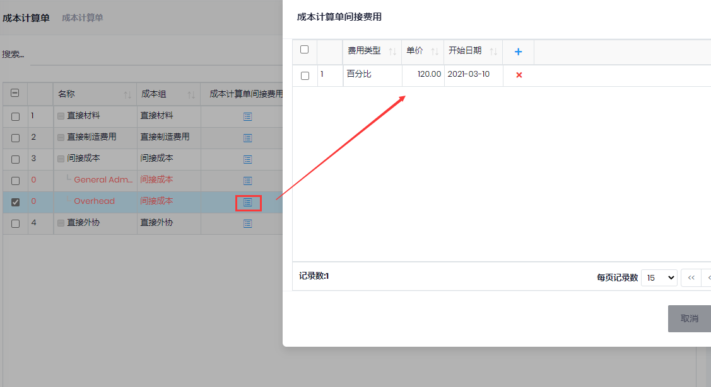
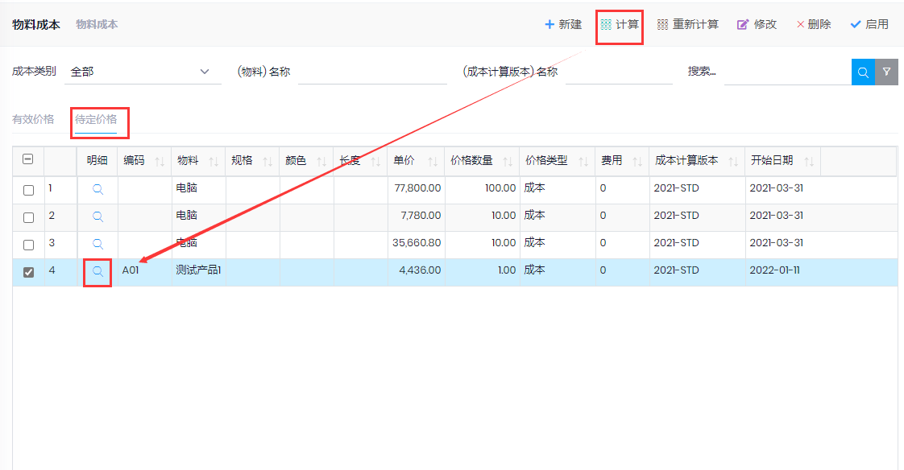
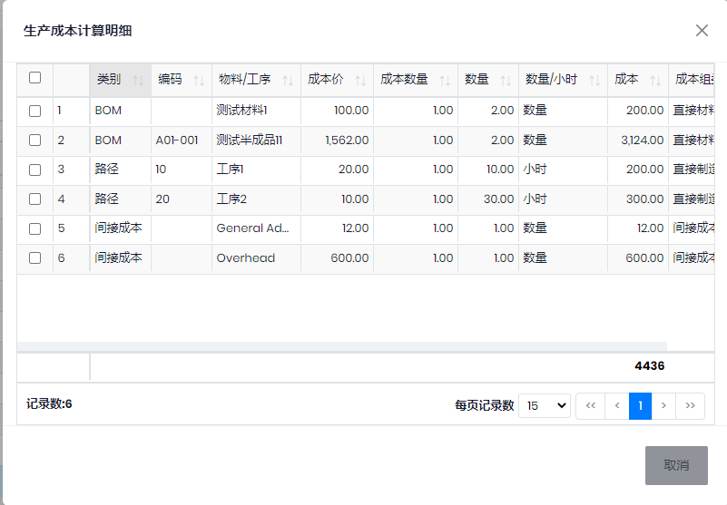

## 基础设置
- 成本组: 库存管理->成本->成本组
- 成本计算单: 设置产品成本的组成
 
- 成本类别: 计划和生产->设置->成本类别
- 工艺路线中设置工序的`成本类别`(数量成本)和"时间成本类别"
- 成本计算版本

## 成本计算
- 库存管理->成本->物料成本
- 点击计算, 填写相关信息, 会根据BOM和工艺路线计算产品的成本. 点击明细可以看成本明细

## 生产单成本

- 路径中设置"设置成本","成本类别"和"时间成本类别"
- 生产单, 点击`操作`->`成本计算`, 计算生产作业的估计成本, 并带入BOM当时的库存"成本单价". 点击`浏览`->`生产成本计算明细`可以查看成本组成

- 生产结束后, 计算生产作业的实际成本, 点击`浏览`->`生产领料明细`, 可以查看物料成本. `生产路径交易`, 可以查看人工成本
