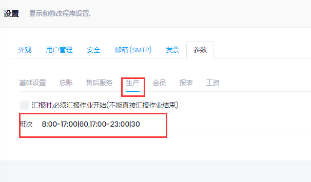

## 作业日记账

- 路径: 计划和生产->作业日记账
- 作业日记账记录每天的作业情况, 按实际的情况录入
  1. 可记录作业开始时间和结束时间, 用于统计工时
  2. 产量按实际完成数量录入, 如果当天工作没有做完, 可以只记录时间, 合格数量为0
- 作业日记账过账后, 会更新对应的`生产作业`的状态和完成数量
- 删除作业日记账时, 将会删除`作业记录`对应的未过账的`质检`单, 如果作业记录对应的质检单已经过账, 则不允许删除, 可以将作业记录的`合格数量`和`时间`设为0, 表示没有进行操作

## 生产汇报

- 生产汇报为作业日记账的简化版, 录入`员工号`, 扫描`生产单`, 选择作业之后, 会自动生成相应的作业日记账. 作业日记账的`日期`为当前日期, `名称`为员工所在的资源组的名称.
- 管理->设置中, 可以设置班次和工作时间. 如下图, 表示分2个班次,第一个班次8:00-17:00, 中间休息60分钟, 第二个班次17:00-23:00, 中间休息30分钟
- 汇报开始时, 作业的结束时间默认为本班次的下班时间
- 汇报作业时, 根据设置的班次自动计算`作业记录`的`小时`

