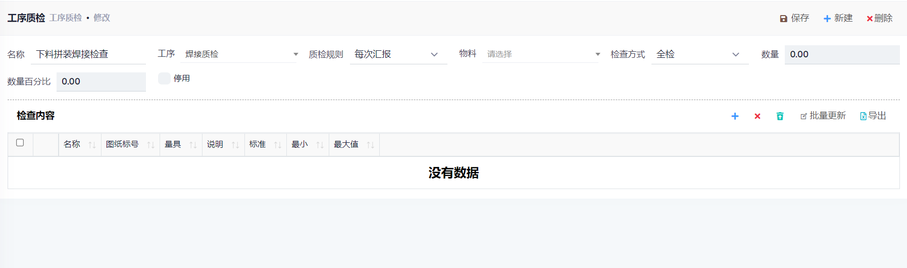

## 设置

- 路径: 计划和生产->设置->工序质检
- 名称: 该质检内容的名称
- 工序: 该质检内容对应的工序
- 质检规则:
  1. 每次汇报: 每次在作业日记账中增加行的时候产生
  2. 作业结束: 作业结束后产生
- 物料: 该检查内容是否针对特定的物料
- 检查方式: 全检或抽检
- 检查内容:

## 操作

- 路径: 计划和生产->质检
- 根据设置的质检内容, 在创建作业日记账时, 会自动根据作业的工序, 生成`质检`内容
- 填写相关的检查信息,并过账
- 如果填写了返修工序, 过账后, 会自动在对应的生产单中增加一步返修工序和质检工序