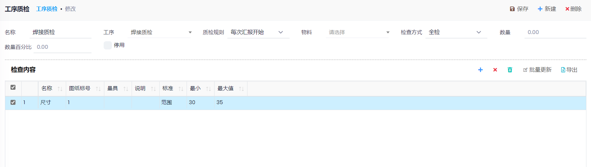

## 设置

- 路径: 计划和生产->设置->工序质检
- 名称: 该质检内容的名称
- 工序: 该质检内容对应的工序
- 质检规则:
  1. `手动`: 不产生质检单 
  2. `工序完成`: 当整个工序结束时产生, 判断条件:生产作业的完成数量+作业日记账的数量>生产作业的数量,或生产作业日记账中选择了`结束`
  3. `每次汇报完成`: 每次在作业日记账中增加行, 并且有合格数量的时候产生
  4. `每次汇报开始`: 每次在作业日记账中增加行, 并且有开始数量的时候产生, **用于有单独的质检工序时**, 质检单根据开始的数量生成, 并且过账质检单的时候, 如果质检单对应的日记账行没有过账,自动设置行的结束时间,并计算行的小时数. 否则会自动生成一个新的日记账行, 但是没有开始时间, 需要手工更新行的小时数
- 物料: 该检查内容是否针对特定的物料
- 检查方式: 全检或抽检
- 检查内容:

## 操作

- 路径: 计划和生产->质检
- 根据设置的质检内容, 在创建作业日记账时, 会自动根据作业的工序, 生成`质检`内容
- 填写相关的检查信息,并`过账`
- 如果`处置方式`为`返修`, 并且填写了`返修工序`, 过账后, 会自动在对应的生产单的生产作业中增加一步返修工序和质检工序. 
- 过账时, 如果质检规则为`每次汇报开始`, 参见上面`质检规则`