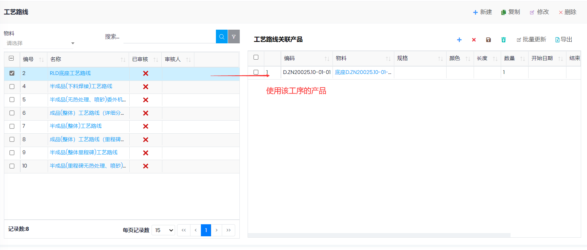
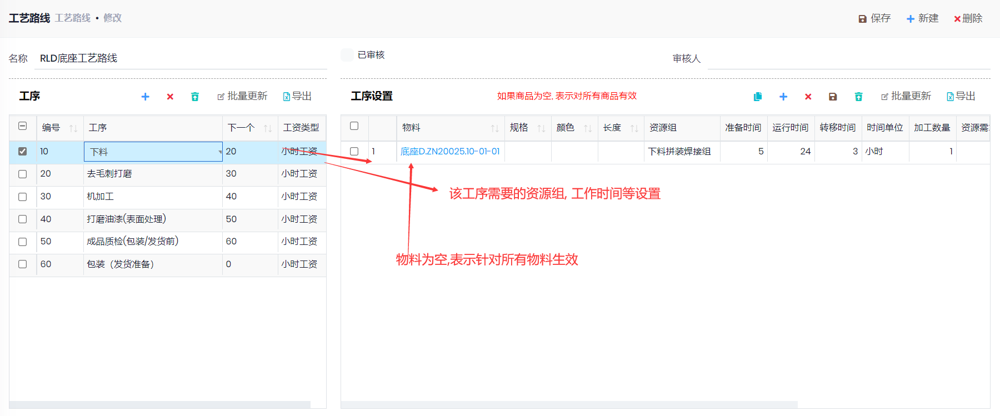

## 设置

- 首先设置以下基本信息
  - [工序](Operations.md)
  - 资源和资源组. 资源添加到资源组时, 可以设置`计划产能百分比`, 如果为0, 表示不参加排产. 数值可以超过100. 排产时, 每天安排的时间根据`计划产能百分比`,可能超出或者少于`日历`中设置的时间.
- 路径: 计划和生产->设置->工艺路线
  - 新建工艺路线, 输入工艺路线名称
  - 设置工艺路线的工序,
  - 设置工序需要的资源组, 工作时间, 需要的资源的数量(如果为0, 表示计划时, 所有人都同时做这个生产单.), 成本类别(按数量计算成本), 时间成本类别(按时间计算成本)

