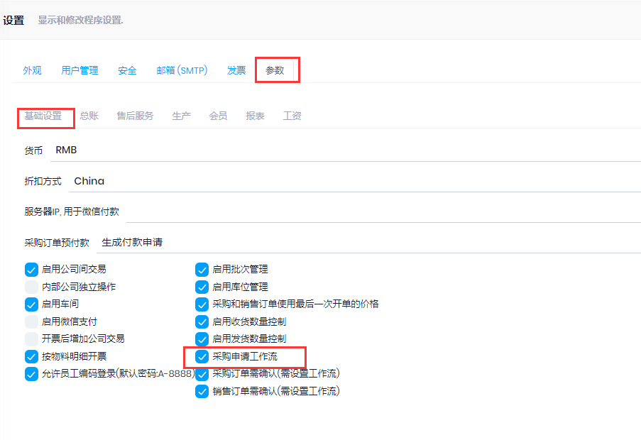
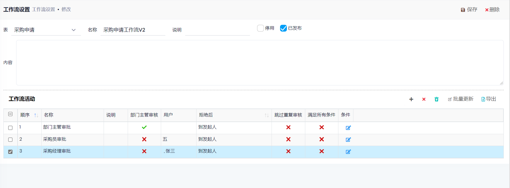
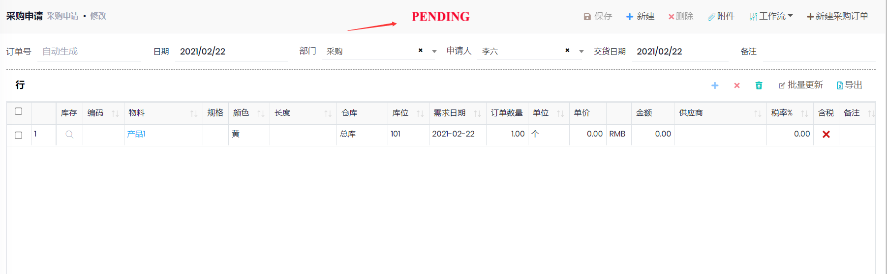


## 审批(两种方式)
1. 采购申请可以启用工作流, 适用于复杂审批流程的情况. 如要启用工作流, 在管理->设置->参数中启用`采购申请工作流`

2. 也可以不启用工作流, 提交申请之后, 有`采购申请批准`权限的人, 可以对采购申请进行批准. 只有两步操作.

## 工作流设置

- 路径: 管理->工作流->工作流设置
- 如下图, 表示采购申请需要3步, 首先部门主管审核, 自动分配给当前用户所在的`组织机构`中设置的主管
- 也可以设置`条件`, 比如金额>5000, 任务分配给指定的人员审核
  

## 操作

- 路径: 采购-->采购申请->新建
- 创建采购申请之后, 须`提交`, 等待审核. 已提交的采购申请状态为`PENDING`
- 如果启用了工作流:
	- 系统自动分配审核任务给工作流设置中的人员, 审核人员会得到`通知`(页面右上角), 如果用户中设置了`接收邮件通知`, 也会收到邮件通知
	- 审核人员在消息列表中点击消息, 或者在邮件中打开连接, 会打开相应的采购申请, 进行批准
- 如果没有启用工作流:
  - 有`采购申请批准`权限的人, 可以对采购申请进行批准. 但不能多个人审批. 
  - 在`通知`中订阅了`采购申请创建`的人, 可以获得`采购申请创建`的通知
- 审核流程结束时(最后一个审核通过, 采购申请的状态变为Approved时), 如果没有设置`供应商`, 会报错
- 审核通过的采购申请, 状态变为`APPROVED`, 可以创建采购单. 可以在采购申请列表,或者`采购申请明细`中选择多个采购申请, 自动根据供应商创建采购订单

