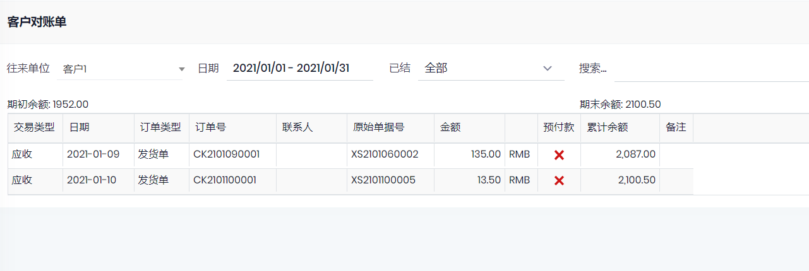

## 基础设置

### 客户
- 路径: 销售->客户
- 根据需要设置客户的信息, 合同信息, 语言等. 打印订单时根据客户的语言, 自动调出相应语言的报表.
- 客户编号:
    - 手工设置或为空.
    - 在`自动编号`中设置. 
    - 在`客户组`中设置, 该设置优先级对于`自动编号`中的设置.
- 客户中设置的信息会自动带到销售单中, 比如地址, 税率,是否含税, 报表模板等. 其中`税率`, 如果`物料`上设置了`税率`, 则覆盖`客户`上设置的税率.
- 可以针对客户设置销售单的`订单编号`, 如果没有设置, 则使用`自动编号`中的`销售订单`编号规则.如果要设置客户的订单编号, 在`自动编号`中**新增**一个类型为`销售订单`的编号规则, 然后选择**新增**的编号规则, 不要选择系统默认的编号.

### 销售价格
可以根据`客户组`设置不同的价格体系和折扣
- 路径: 物料管理->销售价

### 订单和合同打印
在管理->`报表设计`中设计报表的样式

## 操作
- 路径: 销售->销售订单
- 销售订单保存后, 如果设置了`预付款`, 会根据参数设置(管理->设置->参数页), 自动生成`付款申请`或者`付款日记账`, 带出**此时**客户中设置的银行账户等信息, 付款后, 财务部门过账.
- 收货: 参见[发货单](../Onhands/PackingSlip.md)
- 发票: 参见[客户发票](../Financial/AR/Invoice.md)
- 付款: 参见[付款日记账](../Financial/AR/PaymentJournal.md)

## 客户对账单

财务管理-> 应收账款-> 客户对账单

