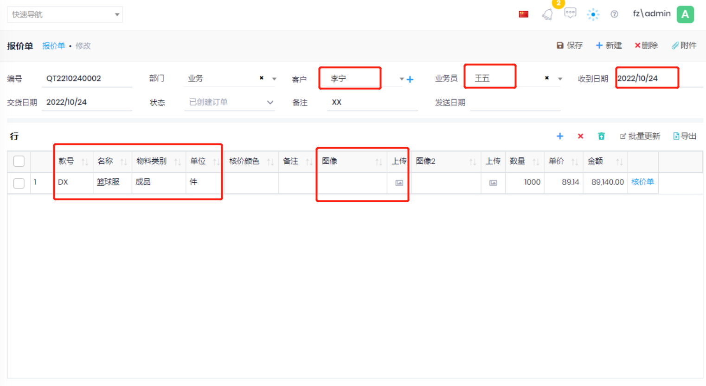

## 报价单

- 新建报价单: 报价和样品-->报价单-->新建
- 根据需要录入信息
    - 下图中红框内为必填项
    - 核价颜色: 如果要为同一款产品不同的颜色进行核价, 可以建多个行, 填写不同的颜色
    - 图片: 根据需要上传
- 保存后, 点击行中的`核价单`连接, 进行[核价](Costing.md).
- 新建报价单时, 不需要考虑数量和单价 
    - 单价: 核价完成, 客户确认价格后,录入客户确认的单价.
    - 数量: 备料表中填写真实的客户订单, 包括颜色,尺码,数量等.
- 核价完成后, 在报价和样品-->报价单-->浏览,选择报价单, 点击`发送`按钮,表示该报价已经发给客户
- 确认: 客户确认后,点击`确认`按钮,录入确认日期和确认单价.
- 备料表: 客户确认后进行
- 销售订单: 
    - 备料表完成后, 点击`销售订单`按钮,可以创建或查询[销售订单](../Sales/Index.md),并自动生成`采购申请`和外协`待定订单`
    - `待定订单`确认并选择外协工厂后, 该款号对应的销售订单和采购订单会从`待定`状态变为`新建`,仓库变为外协的仓库
    - 如果`设置->参数`中没有选中`面辅料送往外协仓库`,则从采购申请生成的采购订单的状态为新建,仓库为自己公司的仓库,之后需要`调拨单`将物料发给外协工厂
- 合同预算表:
- 

    