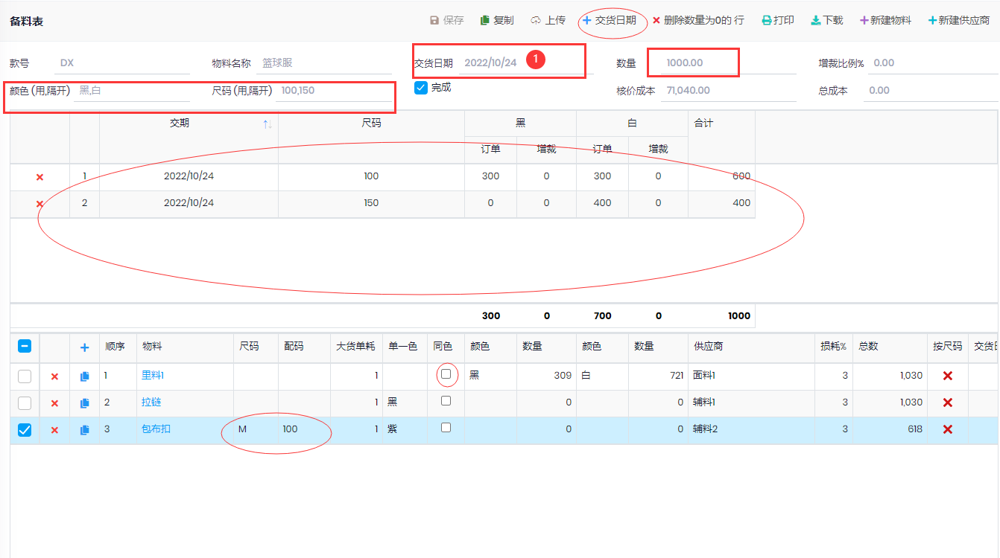

## 备料表

- 报价单确认后进行
- 在报价和样品-->报价单-->浏览, 选择一行,点击上面的`备料表`按钮
- 录入下图红框中的信息之后,自动生成第一个表格中的信息,根据实际情况填入数量. 
- 如需增加交货日期, 录入第一个交货日期的数量之后, 更改①处的交货期,然后点击`+交货日期`按钮,系统自动生成一个交货日期,然后在第一个表格中录入数量
- 备料表保存后, 如果`核价成本`<`总成本`,界面颜色显示为黄色,表示备料表的成本超出了预算

### 面辅料
- 尺码: 表示该物料的尺码,如果该尺码针对特定的成品尺码, 在`配码`中填写
- 单一色: 表示不管成品什么颜色,该物料都用同一种颜色, 此时数量为`总数`列中的数.
- 同色: 表示该物料的颜色同成品的颜色, 选中后,自动设置颜色和需要的数量
- 按尺码: 表示该物料和成品的尺码一样
- 复制行

