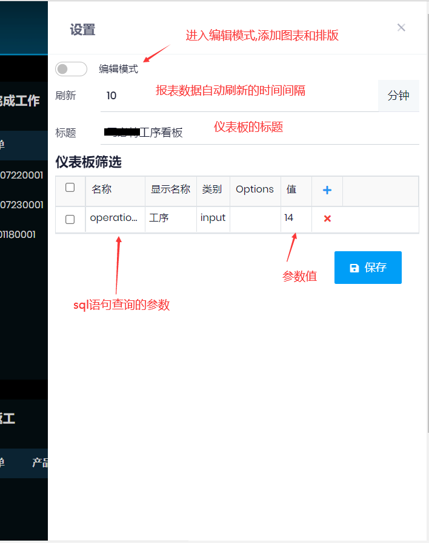

## 图表
- 用于在仪表板中显示
- **名称**,
- **标题**, 
- **文件**: javascript的文件名, 不带js扩展名, 须上传到服务器, 例如:
  ```js
  (function () {
    app.customWidgets.CurrentJobWidget = function () { //CurrentJobWidget为class名字, 需要自行修改
    //脚本内容
      var _widget;       
        var _widgetBody;

        this.init = function (widgetManager) {
            _widget = widgetManager.getWidget();
            _widgetBody = _widget.find('.card-body');
        };
        //必须的函数, 用于读取数据之后, 设置页面的显示   
        this.showData = function (data) {
            _widgetBody.empty();
            /*页面显示内容, 根据需要修改*/
            data.forEach(d => {
                var endDate = moment(d.EndDate);

                var group = $(`<div class="mb-10"></div>`);
                var row = $(`<div class="d-flex justify-content-between"></div>`);               
                row.append(`<div class="form-group"><label>生产单:</label><label>${d.ProdId}</label></div>`);
                row.append(`<div class="form-group"><label>人员:</label><label>${d.Name}</label></div>`);
                group.append(row);
                row = $(`<div class="d-flex justify-content-between"></div>`);  
                row.append(`<div class="form-group"><label>产品编码:</label><label>${d.ItemCode}</label></div>`);
                row.append(`<div class="form-group"><label>产品名称:</label><label>${d.ItemName}</label></div>`);
                group.append(row);
                row = $(`<div class="d-flex justify-content-between"></div>`);
                row.append(`<div class="form-group"><label>实际开始日期:</label><label>${moment(d.ActualStartDate).format('YYYY-MM-DD')}</label></div>`);
                row.append(`<div class="form-group ${endDate < moment() ? "red" : ""}"><label>计划结束日期:</label><label>${endDate.format('YYYY-MM-DD')}</label></div>`);
                group.append(row);
                var progress = "25%";
                var finishedQty = d.JournalQty + d.FinishedQty;

                if (finishedQty)
                    progress = finishedQty / (d.Qty || 1) * 100;
                else
                    progress = d.ActualHours / (d.WorkHours || 1) * 100;
                progress = app.formatNum(progress, 2) + '%';

                group.append(`<div class="progress h-30px"><div class="progress-bar bg-success" role="progressbar" aria-valuenow="0" style="width:${progress};" aria-valuemin="0" aria-valuemax="100">${progress}</div></div>`);
                _widgetBody.append(group);
            });

        }       
     }
  })();
  ```
- **内容**: html, 定义图表显示的内容

```html
<div class="card card-custom h-100">
    <div class="card-header">
        <div class="card-title">
            <h4>当前工作</h4>
        </div>
    </div>
    <div class="card-body">
    </div>
</div>
```
- **设置**: sql语句, 从数据库读取要显示的数据
## 仪表板
- 定义好图表之后, 将图表添加到仪表板
- **名称**: 仪表板的名称, 用于显示在**工作台**, *自定义报表*中
- **类别**: 自定义报表的类别
- **许可**: 权限
- **内容**: 一般不需要手工设置, 点***预览***按钮之后, 可以增加图表, 调整图表的大小和位置等

## 仪表板设置


- 点击右上角的设置(齿轮)按钮
- 编辑模式: 打开之后, 可以添加自定义图表, 并调整图表的位置和大小
- 刷新: 自动刷新数据的间隔
- 标题: 设置之后, 只针对当前的电脑起作用, 不同的电脑可以设置不同的标题
- 筛选: 设置筛选条件, **名称**需要和图表中的sql语句**查询参数**对应, 值只针对当前电脑有效


